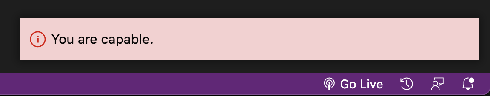

</a>

 

&nbsp;&nbsp;&nbsp;&nbsp;

<!--  -->

    

   

## Languages, Tools & Framworks

 

    
    

Languages: JavaScript, HTML5, CSS3, SQL 

Frameworks/Libraries: React, Express & Node 

Databases: Supabase, PostgresSQL 

Tools: Github, Beekeeper, Salesforce, Heroku, Netsuite, Ajera, Infor, Vision 

Dev Practices: TDD, DDD Pair & Mob Programming, Object Oriented Programming OOP 
 
  
  

 
   

## Try my VSCode Extension "Error-Affirmations"!

A VSCode Extension and custom Jest reporter designed to foster positive thought and self-improvement through error based and daily affirmations.
  

[Error Affirmations](https://marketplace.visualstudio.com/items?itemName=VSCodeEmpaths.erroraffirmations&ssr=false#overview)

